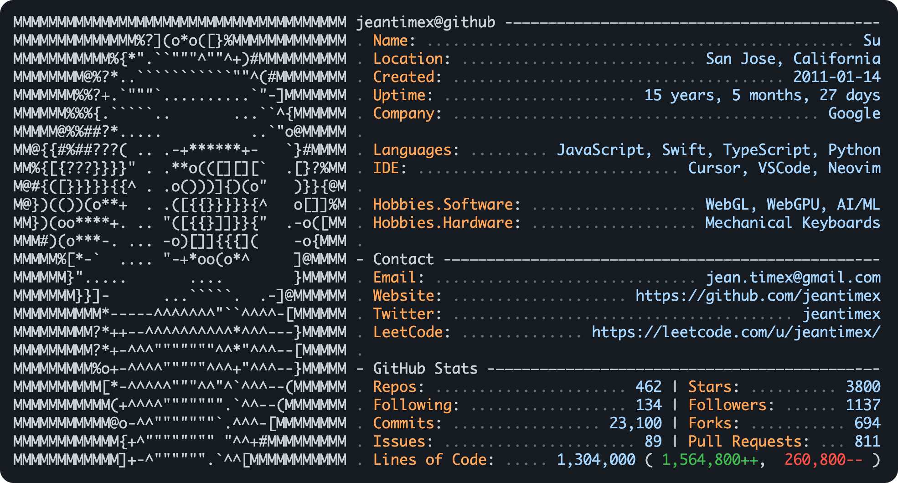
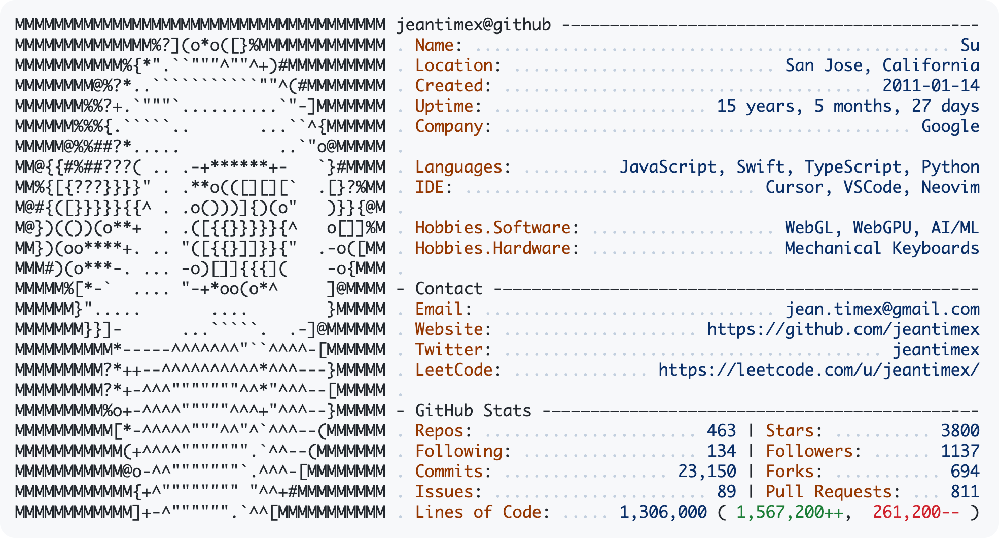

<div align="center">
  <h1 style="font-size: 28px; margin: 10px 0;">GitHub Neofetch Profile</h1>
  <p>Generate a retro terminal-style stats card for your GitHub profile README — just like [neofetch](https://github.com/dylanaraps/neofetch), but for GitHub!</p>
</div>

<div align="center">
  
  <p>Dark mode</p>
</div>
<div align="center">
  
  <p>Light mode</p>
</div>

## Features

- **ASCII Avatar** — Your GitHub profile picture converted to ASCII art
- **Real-time Stats** — Repos, stars, commits, followers, and lines of code
- **Dark/Light Themes** — Automatically matches the viewer's GitHub theme
- **Fully Customizable** — Add your own sections via JSON config
- **No Setup Required** — Just add the URL to your README

## Table of Contents

- [Quick Start](#quick-start)
- [Add to Your GitHub Profile](#add-to-your-github-profile)
- [Dark/Light Mode Support](#darklight-mode-support)
- [Parameters](#parameters)
- [Custom Configuration](#custom-configuration)
- [Deploy Your Own](#deploy-your-own)
- [Local Development](#local-development)

## Quick Start

Add this to your GitHub profile README:

```markdown

```

Replace `YOUR_USERNAME` with your GitHub username. That's it!

## Add to Your GitHub Profile

### Step 1: Create Your Profile Repository

If you don't have one yet, create a repository with the **same name as your GitHub username** (e.g., `username/username`). This is a special repository — its `README.md` appears on your GitHub profile page.

### Step 2: Add the Card to Your README

Edit your profile `README.md` and add:

```markdown

```

### Step 3: Commit and View

Commit the changes and visit your GitHub profile. Your neofetch card will appear!

## Dark/Light Mode Support

GitHub users can choose dark or light themes. Use the `<picture>` element to automatically show the right theme:

```html
<a href="https://github.com/jeantimex/neofetch-profile">
  <picture>
    <source media="(prefers-color-scheme: dark)" srcset="https://neofetch-profile.vercel.app/api?username=YOUR_USERNAME&theme=github-dark">
    
  </picture>
</a>
```

### Centered Version

```html
<p align="center">
  <a href="https://github.com/jeantimex/neofetch-profile">
    <picture>
      <source media="(prefers-color-scheme: dark)" srcset="https://neofetch-profile.vercel.app/api?username=YOUR_USERNAME&theme=github-dark">
      
    </picture>
  </a>
</p>
```

## Parameters

| Parameter | Description | Default |
|-----------|-------------|---------|
| `username` | Your GitHub username (required) | — |
| `theme` | `github-dark` or `github-light` | `github-dark` |
| `config` | URL to a JSON config file | — |

### Examples

```
# Basic
https://neofetch-profile.vercel.app/api?username=jeantimex

# Light theme
https://neofetch-profile.vercel.app/api?username=jeantimex&theme=github-light

# With custom config
https://neofetch-profile.vercel.app/api?username=jeantimex&config=https://raw.githubusercontent.com/jeantimex/jeantimex/main/neofetch.json
```

## Custom Configuration

Want to customize the info displayed? Host a JSON config file and pass its URL.

### Step 1: Create Config File

Create `neofetch.json` in your profile repository:

```json
{
  "sections": [
    {
      "title": "{{username}}@github",
      "fields": [
        { "key": "Name", "value": "{{name}}" },
        { "key": "Location", "value": "{{location}}" },
        { "key": "Created", "value": "{{created}}" },
        { "key": "Uptime", "value": "{{uptime}}" },
        { "key": "Company", "value": "{{company}}" }
      ]
    },
    {
      "fields": [
        { "key": "Languages", "value": "{{languages}}" },
        { "key": "IDE", "value": "Cursor, VSCode, Neovim" }
      ]
    },
    {
      "fields": [
        { "key": "Hobbies.Software", "value": "WebGL, WebGPU, AI/ML" },
        { "key": "Hobbies.Hardware", "value": "Mechanical Keyboards" }
      ]
    },
    {
      "title": "- Contact",
      "fields": [
        { "key": "Email", "value": "{{email}}" },
        { "key": "Website", "value": "https://github.com/{{username}}" },
        { "key": "Twitter", "value": "{{twitter}}" }
      ]
    }
  ],
  "stats": {
    "title": "- GitHub Stats",
    "rows": [
      { "left": { "key": "Repos", "value": "{{repos}}" }, "right": { "key": "Stars", "value": "{{stars}}" } },
      { "left": { "key": "Following", "value": "{{following}}" }, "right": { "key": "Followers", "value": "{{followers}}" } },
      { "left": { "key": "Commits", "value": "{{commits}}" }, "right": { "key": "Forks", "value": "{{forks}}" } },
      { "left": { "key": "Issues", "value": "{{issues}}" }, "right": { "key": "PRs", "value": "{{prs}}" } },
      "loc"
    ]
  }
}
```

### Step 2: Get the Raw URL

After committing, get the raw URL:

```
https://raw.githubusercontent.com/YOUR_USERNAME/YOUR_USERNAME/main/neofetch.json
```

### Step 3: Add Config Parameter

```markdown

```

### Template Variables

Use these variables in your config to pull data from GitHub automatically:

| Variable | Description | Example Output |
|----------|-------------|----------------|
| `{{username}}` | GitHub username | `jeantimex` |
| `{{name}}` | Display name | `Yong Su` |
| `{{company}}` | Company (auto-capitalized) | `Apple Inc` |
| `{{location}}` | Location | `San Francisco, CA` |
| `{{bio}}` | Bio (first 40 chars) | `Software Engineer` |
| `{{uptime}}` | Account age | `10 years, 3 months, 5 days` |
| `{{created}}` | Account creation date | `2015-03-21` |
| `{{languages}}` | Top 4 programming languages | `TypeScript, Python, Go, Rust` |
| `{{repos}}` | Number of repositories | `42` |
| `{{stars}}` | Total stars received | `128` |
| `{{forks}}` | Total forks across repos | `64` |
| `{{gists}}` | Number of public gists | `12` |
| `{{issues}}` | Total issues created | `85` |
| `{{prs}}` | Total pull requests created | `142` |
| `{{commits}}` | Estimated total commits | `5,000` |
| `{{followers}}` | Follower count | `256` |
| `{{following}}` | Following count | `128` |
| `{{email}}` | Public email | `you@example.com` |
| `{{blog}}` | Website/blog URL | `yoursite.com` |
| `{{twitter}}` | Twitter/X username | `yourhandle` |

### Config Structure

| Field | Description |
|-------|-------------|
| `sections` | Array of sections to display |
| `sections[].title` | Section header (optional). Use `"{{username}}@github"` for the first section, `"- Section Name"` for others |
| `sections[].fields` | Array of `{ "key": "Label", "value": "Text or {{variable}}" }` objects |
| `stats` | GitHub Stats section configuration (optional) |
| `stats.title` | Stats section title (default: `"- GitHub Stats"`) |
| `stats.enabled` | Set to `false` to hide stats section |
| `stats.rows` | Array of row types to display |

### Stats Row Types

| Row Type | Description |
|----------|-------------|
| `{ "left": {...}, "right": {...} }` | Split row with `\|` separator. Each side has `key` and `value` |
| `"loc"` | Special row: `Lines of Code: X ( Y++, Z-- )` |

### Example Stats Config

```json
{
  "stats": {
    "title": "- GitHub Stats",
    "rows": [
      { "left": { "key": "Repos", "value": "{{repos}}" }, "right": { "key": "Stars", "value": "{{stars}}" } },
      { "left": { "key": "Commits", "value": "{{commits}}" }, "right": { "key": "Followers", "value": "{{followers}}" } },
      { "left": { "key": "Forks", "value": "{{forks}}" }, "right": { "key": "Gists", "value": "{{gists}}" } },
      "loc"
    ]
  }
}
```

To hide the stats section entirely:

```json
{
  "stats": {
    "enabled": false
  }
}
```

## Deploy Your Own

For private repo stats or higher rate limits, deploy your own instance:

[](https://vercel.com/new/clone?repository-url=https://github.com/jeantimex/neofetch-profile)

### Add GitHub Token (Optional)

For private repos or to avoid rate limits:

1. Go to [GitHub Settings → Developer settings → Personal access tokens → Tokens (classic)](https://github.com/settings/tokens)
2. Click **Generate new token (classic)**
3. Select the `repo` scope
4. Copy the token
5. In your Vercel project, go to **Settings → Environment Variables**
6. Add `GITHUB_TOKEN` with your token value

## Local Development

```bash
# Clone the repo
git clone https://github.com/jeantimex/neofetch-profile.git
cd neofetch-profile

# Install dependencies
npm install

# Create .env file with your GitHub token
echo "GITHUB_TOKEN=your_token_here" > .env

# Run locally (requires Vercel CLI)
vercel dev
```

### Test URLs

Basic usage:
```
http://localhost:3000/api?username=YOUR_USERNAME
```

With theme:
```
http://localhost:3000/api?username=YOUR_USERNAME&theme=github-light
```

With local config file (edit `public/config.json` to customize):
```
http://localhost:3000/api?username=YOUR_USERNAME&config=http://localhost:3000/config.json
```

## How It Works

1. Fetches your GitHub profile and repository data via the GitHub API
2. Converts your avatar to ASCII art using image processing
3. Calculates stats: repos, stars, total commits, followers, lines of code
4. Generates an SVG with neofetch-style terminal aesthetics
5. Caches the result for 4 hours for performance

## Credits

Inspired by:
- [neofetch](https://github.com/dylanaraps/neofetch) — The original CLI system info tool
- [github-readme-stats](https://github.com/anuraghazra/github-readme-stats) — GitHub stats cards
- [Andrew Grant](https://github.com/Andrew6rant) — The original neofetch-style GitHub profile

## License

MIT
